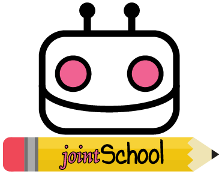

# jointSchool

## Requeriments/dependencies
* [NodeJS](https://nodejs.org/en/)
* [Ionic](http://ionicframework.com/docs/v2/intro/installation/)
* [Cordova](https://cordova.apache.org/)
* [Typescript](https://www.typescriptlang.org/)
* [Typings](https://www.npmjs.com/package/typings)

## Installation
```bash
npm install
typings install
```

## Run
```bash
ionic serve
```

* Server running: http://localhost:8100/

<p align="center">
  </img>
</p>
